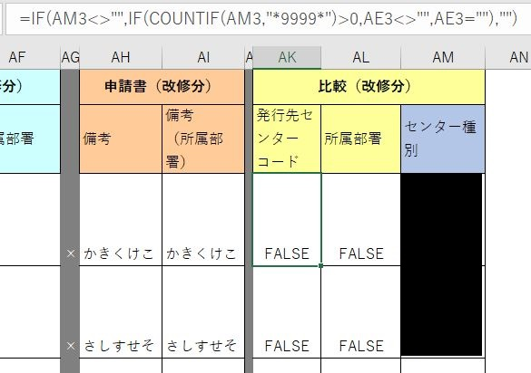
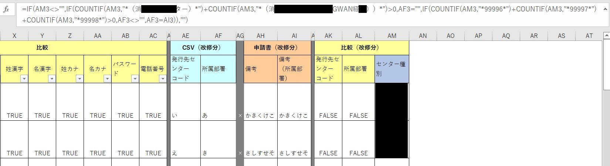
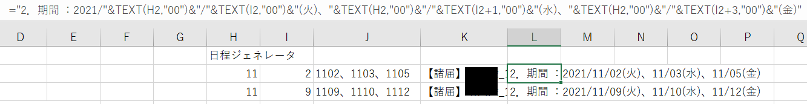
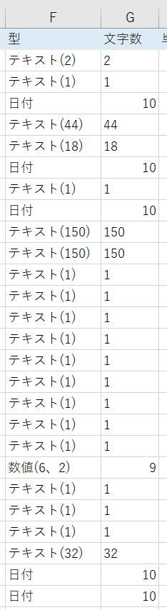
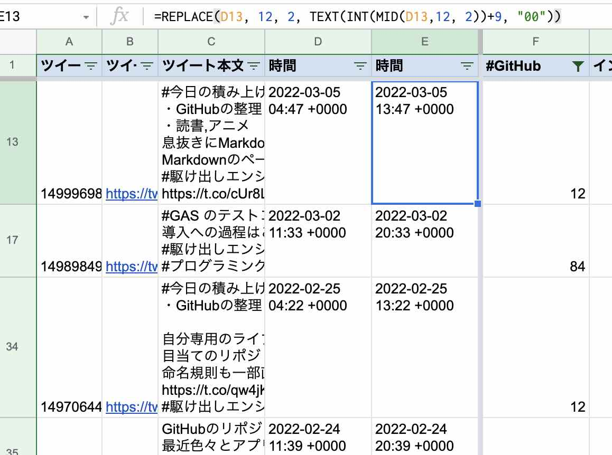

# SpreadsheetFunctionsRecipe

  
  

# Table of Content

- [SpreadsheetFunctionsRecipe](#spreadsheetfunctionsrecipe)
- [Table of Content](#table-of-content)
- [20210401_LedgerForPcBringing](#20210401_ledgerforpcbringing)
- [20210408_TheToolPreventingMistakesForAccountOperation](#20210408_thetoolpreventingmistakesforaccountoperation)
- [20210630_GetHyperlinkThatPathOrUrl](#20210630_gethyperlinkthatpathorurl)
- [20211102_GenerateDateInOrder](#20211102_generatedateinorder)
- [20211103_GetTextBySequentialDates](#20211103_gettextbysequentialdates)
- [20211104_GetTextByToday](#20211104_gettextbytoday)
- [20220110_LetByteOfRemainingOfPropsiteDetailItemsList](#20220110_letbyteofremainingofpropsitedetailitemslist)
- [20220304_GetDigitsByDataTypeSfdc](#20220304_getdigitsbydatatypesfdc)
- [20220310_AddHourToTwitterDate](#20220310_addhourtotwitterdate)
- [20220323_AddPrefix](#20220323_addprefix)
- [20220413_ChainToOrderItems](#20220413_chaintoorderitems)

# [20210401_LedgerForPcBringing](./20210401_ledgerforpcbringing)

<table>
  <tr>
    <td width="50%">
      
    </td>
    <td width="50%">
      
    </td>
  </tr>
  <tr>
    <td width="50%">
      
    </td>
    <td width="50%">
      <pre data-role="codeBlock" data-info="code:visualbasic" class="language-code:visualbasic"><code>=AND($L9<>"",$L9>$G9)
=AND($L9="",$G9<>"",$G9&lt;TODAY())
=MOD(ROW(),2)=1
=AND($K9<>"",$K9<$F9)
=AND($K9="",$F9<>"")
=MOD(ROW(),2)=1</code></pre>
    </td>
  </tr>
</table>

# 20210408_TheToolPreventingMistakesForAccountOperation

<table>
  <tr>
    <td>
      
    </td>
    <td>
      
    </td>
  </tr>
  <tr>
    <td>
      <pre data-role="codeBlock" data-info="code:visualbasic" class="language-code:visualbasic"><code>
=IF(
  AND(AK3<>"",AL3<>"")
  ,IF(
    AND(AK3=TRUE,AL3=TRUE)
    ,"〇"
    ,"×"
  )
  ,""
)
      </code></pre>
    </td>
    <td>
      <pre data-role="codeBlock" data-info="code:visualbasic" class="language-code:visualbasic"><code>
=IF(
  AM3<>""
  ,IF(
    COUNTIF(
      AM3
      ,"*9999*"
    )>0
    ,AE3<>""
    ,AE3=""
  )
  ,""
)
      </code></pre>
    </td>
  </tr>
  <tr>
    <td colspan="2">
      
    </td>
  </tr>
  <tr>
    <td colspan="2">
      <pre data-role="codeBlock" data-info="code:visualbasic" class="language-code:visualbasic"><code>
=IF(
  AM3<>""
  ,IF(
    COUNTIF(
      AM3
      ,"*（消○○○○○○ター）*"
    )+COUNTIF(
      AM3
      ,"*（消○○○○○○○○（○○GWAN経○○））*"
    )>0
    ,AF3=""
    ,IF(
      COUNTIF(
        AM3
        ,"*99996*"
      )+COUNTIF(
        AM3
        ,"*99997*"
      )+COUNTIF(
        AM3
        ,"*99998*"
      )>0
      ,AF3<>""
      ,AF3=AI3
    )
  )
  ,""
)
      </code></pre>
    </td>
  </tr>
</table>

# 20210630_GetHyperlinkThatPathOrUrl

<table>
  <tr>
    <td>
      
    </td>
  </tr>
  <tr>
    <td>
      <!-- 20210630_start -->
      <pre data-role="codeBlock" data-info="code:visualbasic" class="language-code:visualbasic"><code></code></pre>
      <!-- 20210630_end -->
    </td>
  </tr>
</table>

# 20211102_GenerateDateInOrder

<table>
  <tr>
    <td>
      
    </td>
  </tr>
  <tr>
    <td>
      <!-- 20211102_start -->
      <pre data-role="codeBlock" data-info="code:visualbasic" class="language-code:visualbasic"><code></code></pre>
      <!-- 20211102_end -->
    </td>
  </tr>
</table>

# 20211103_GetTextBySequentialDates

<table>
  <tr>
    <td>
      
    </td>
  </tr>
  <tr>
    <td>
      <!-- 20211103_start -->
      <pre data-role="codeBlock" data-info="code:visualbasic" class="language-code:visualbasic"><code></code></pre>
      <!-- 20211103_end -->
    </td>
  </tr>
</table>

# 20211104_GetTextByToday

<table>
  <tr>
    <td>
      
    </td>
  </tr>
  <tr>
    <td>
      <!-- 20211104_start -->
      <pre data-role="codeBlock" data-info="code:visualbasic" class="language-code:visualbasic"><code></code></pre>
      <!-- 20211104_end -->
    </td>
  </tr>
</table>

# 20220110_LetByteOfRemainingOfPropsiteDetailItemsList

<table>
  <tr>
    <td>
      
    </td>
  </tr>
  <tr>
    <td>
      <!-- 20220110_start -->
      <pre data-role="codeBlock" data-info="code:visualbasic" class="language-code:visualbasic"><code></code></pre>
      <!-- 20220110_end -->
    </td>
  </tr>
</table>

# 20220304_GetDigitsByDataTypeSfdc

<table>
  <tr>
    <td>
      
    </td>
    <td>
      <pre data-role="codeBlock" data-info="code:visualbasic" class="language-code:visualbasic"><code>
  =IF(
    LEFT(F2,4)="テキスト"
    ,IFERROR(
      MID(
        F2
        ,FIND("(",F2)+1
        ,FIND(")",F2)-FIND("(",F2)-1
      )
      ,10
    )
    ,IF(
      LEFT(F2,4)="日付"
      ,10
      ,IF(
        LEFT(F2,2)="数値"
        ,LEFT(
          MID(
            F2
            ,FIND("(",F2)+1
            ,FIND(")",F2)-FIND("(",F2)-1
          )
          ,1
        )+RIGHT(
          MID(
            F2
            ,FIND("(",F2)+1
            ,FIND(")",F2)-FIND("(",F2)-1
          )
          ,1
        )+1
        ,FALSE
      )
    )
  )</code></pre>
    </td>
  </tr>
</table>

# 20220310_AddHourToTwitterDate

<table>
  <tr>
    <td>
      
    </td>
  </tr>
  <tr>
    <td>
      <!-- 20220310_start -->
      <pre data-role="codeBlock" data-info="code:visualbasic" class="language-code:visualbasic"><code></code></pre>
      <!-- 20220310_end -->
    </td>
  </tr>
</table>

# 20220323_AddPrefix

<table>
  <tr>
    <td>
      
    </td>
  </tr>
  <tr>
    <td>
      <!-- 20220323_start -->
      <pre data-role="codeBlock" data-info="code:visualbasic" class="language-code:visualbasic"><code></code></pre>
      <!-- 20220323_end -->
    </td>
  </tr>
</table>

# 20220413_ChainToOrderItems

If you sort spreadsheet with this function, you may see an error of circular reference.
