# SpreadsheetFunctionsRecipe

  
  

# Table of Content

- [SpreadsheetFunctionsRecipe](#spreadsheetfunctionsrecipe)
- [Table of Content](#table-of-content)
- [20210401_LedgerForPcBringing](#20210401_ledgerforpcbringing)
- [20210408_TheToolPreventingMistakesForAccountOperation](#20210408_thetoolpreventingmistakesforaccountoperation)
- [20210630_GetHyperlinkThatPathOrUrl](#20210630_gethyperlinkthatpathorurl)
- [20211102_GenerateDateInOrder](#20211102_generatedateinorder)
- [20211102_GetTextBySequentialDates](#20211102_gettextbysequentialdates)
- [20211102_GetTextByToday](#20211102_gettextbytoday)
- [20220110_LetByteOfRemainingOfPropsiteDetailItemsList](#20220110_letbyteofremainingofpropsitedetailitemslist)
- [20220304_getDigitsByDataTypeSFDC](#20220304_getdigitsbydatatypesfdc)
- [20220310_add_hour_to_twitter_date](#20220310_add_hour_to_twitter_date)
- [20220323_AddPrefix](#20220323_addprefix)

# 20210401_LedgerForPcBringing

<table>
  <tr>
    <td width="50%">
      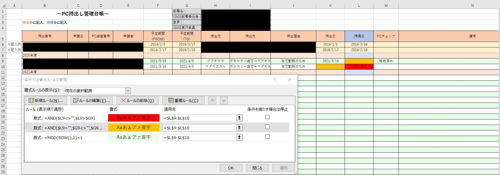
    </td>
    <td width="50%">
      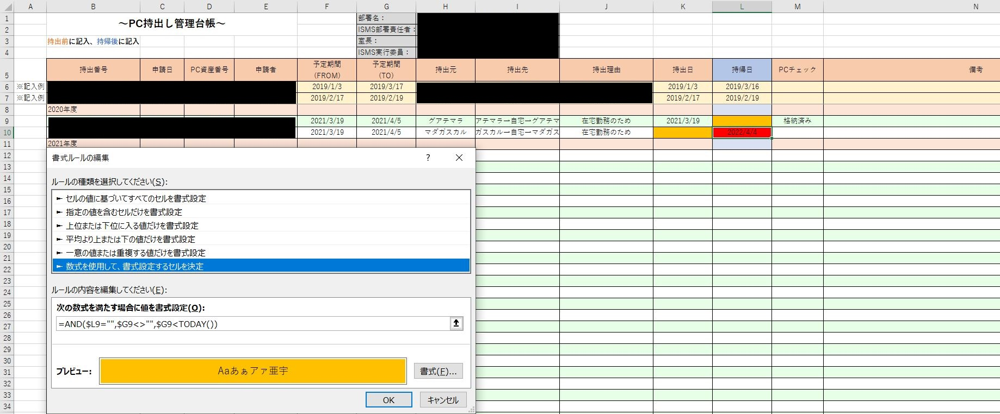
    </td>
  </tr>
  <tr>
    <td width="50%">
      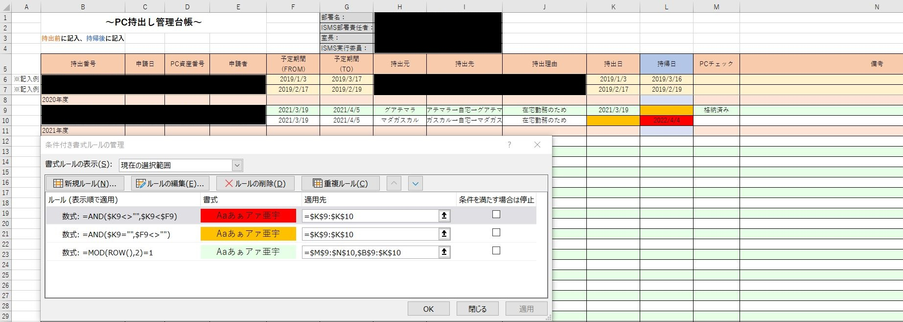
    </td>
    <td width="50%">
      <pre data-role="codeBlock" data-info="code:visualbasic" class="language-code:visualbasic"><code>=AND($L9<>"",$L9>$G9)
=AND($L9="",$G9<>"",$G9&lt;TODAY())
=MOD(ROW(),2)=1
=AND($K9<>"",$K9<$F9)
=AND($K9="",$F9<>"")
=MOD(ROW(),2)=1</code></pre>
    </td>
  </tr>
</table>

# 20210408_TheToolPreventingMistakesForAccountOperation

<table>
  <tr>
    <td>
      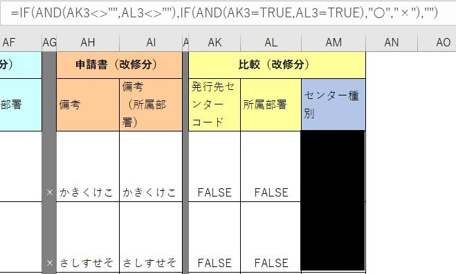
    </td>
    <td>

    </td>
  </tr>
</table>

# 20210630_GetHyperlinkThatPathOrUrl

<table>
  <tr>
    <td>
      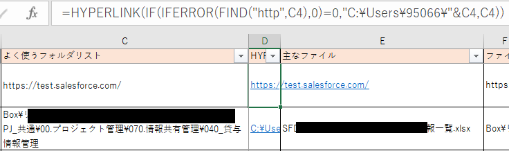
    </td>
    <td>
      <pre data-role="codeBlock" data-info="code:visualbasic" class="language-code:visualbasic"><code></code></pre>
    </td>
  </tr>
</table>

# 20211102_GenerateDateInOrder

<table>
  <tr>
    <td>
      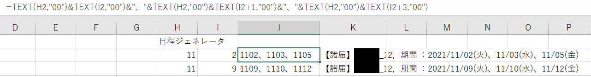
    </td>
    <td>

    </td>
  </tr>
</table>

# 20211102_GetTextBySequentialDates

<table>
  <tr>
    <td>
      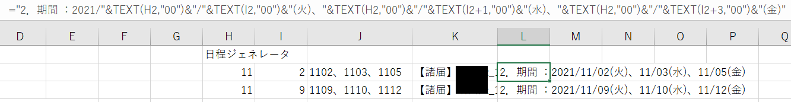
    </td>
    <td>

    </td>
  </tr>
</table>

# 20211102_GetTextByToday

<table>
  <tr>
    <td>
      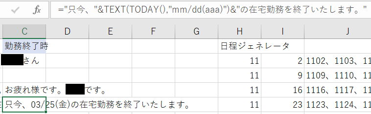
    </td>
    <td>

    </td>
  </tr>
</table>

# 20220110_LetByteOfRemainingOfPropsiteDetailItemsList

<table>
  <tr>
    <td>
      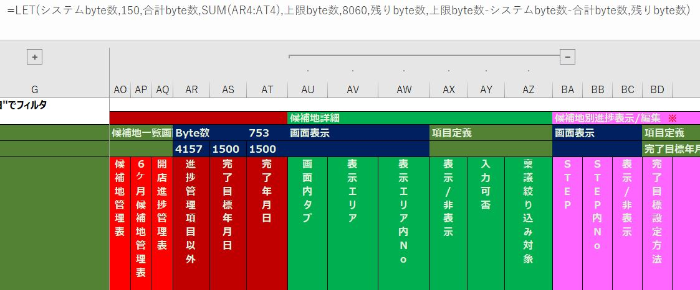
    </td>
    <td>

    </td>
  </tr>
</table>

# 20220304_getDigitsByDataTypeSFDC

<table>
  <tr>
    <td>
      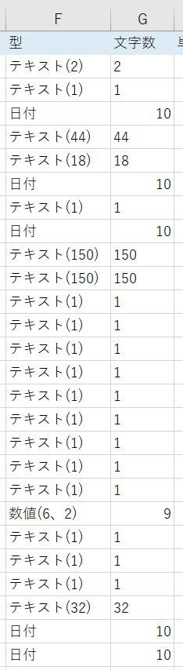
    </td>
    <td>

    </td>
  </tr>
</table>

# 20220310_add_hour_to_twitter_date

<table>
  <tr>
    <td>
      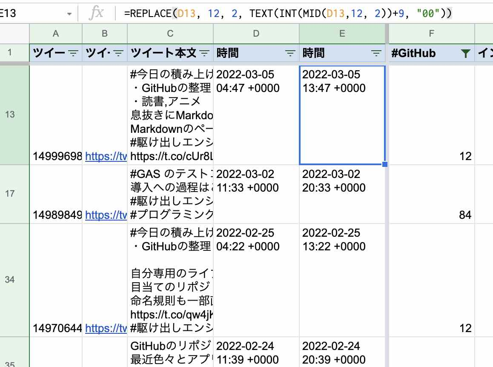
    </td>
    <td>

    </td>
  </tr>
</table>

# 20220323_AddPrefix

<table>
  <tr>
    <td>
      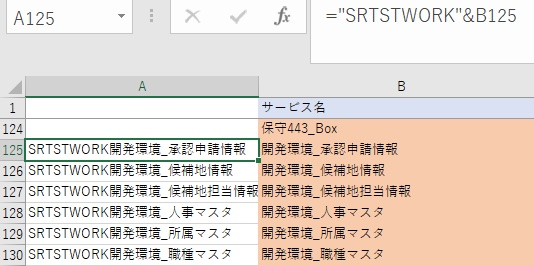
    </td>
    <td>

    </td>
  </tr>
</table>
